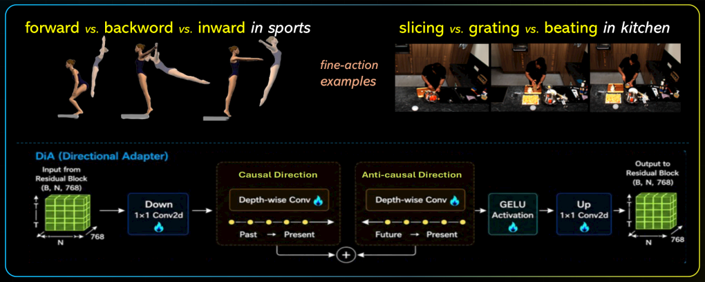
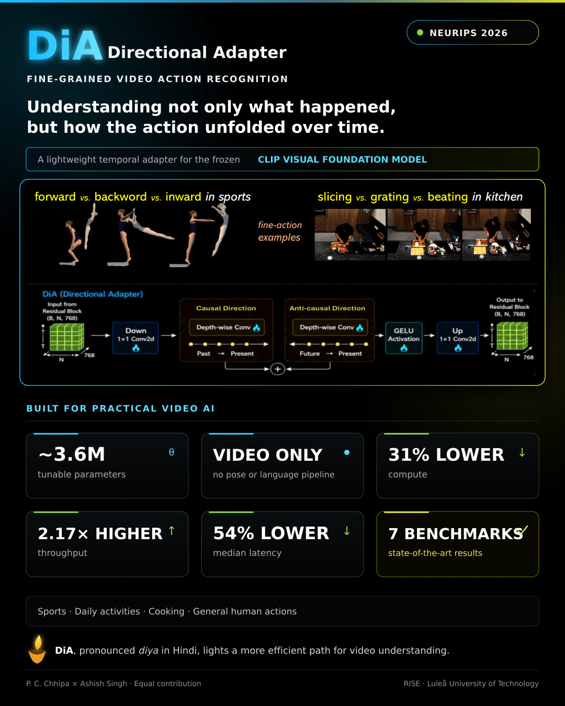
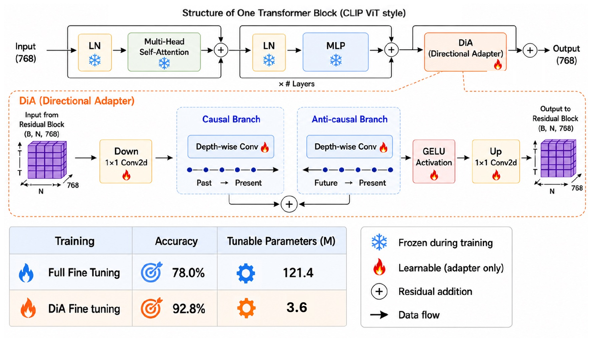
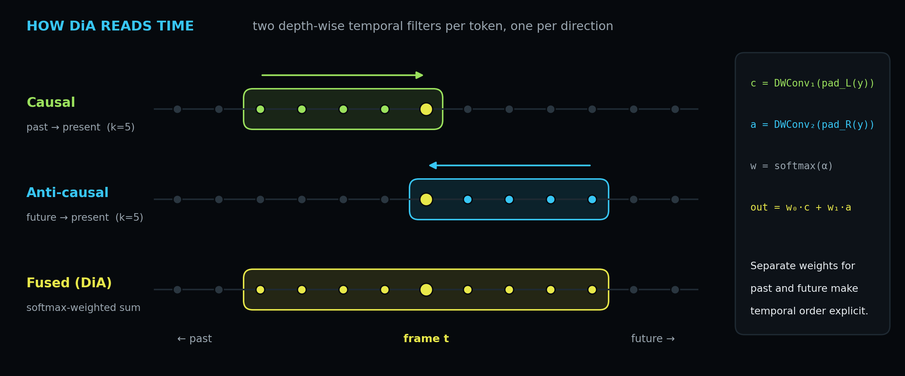
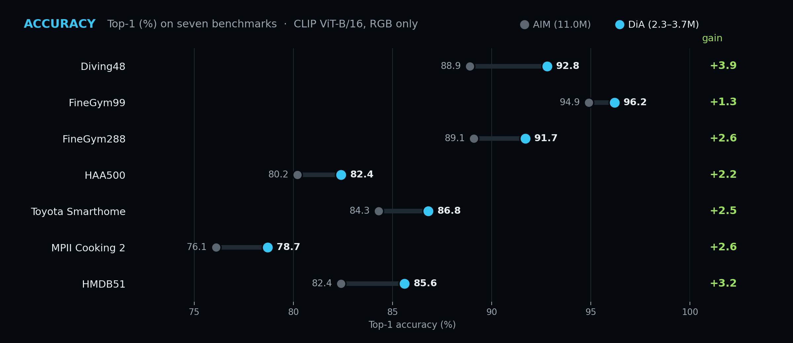
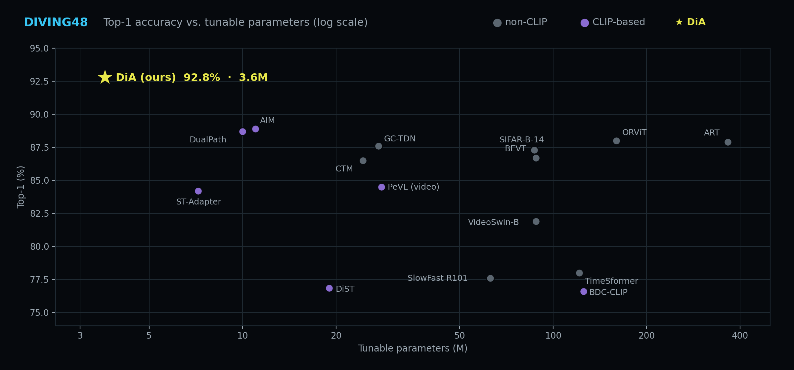
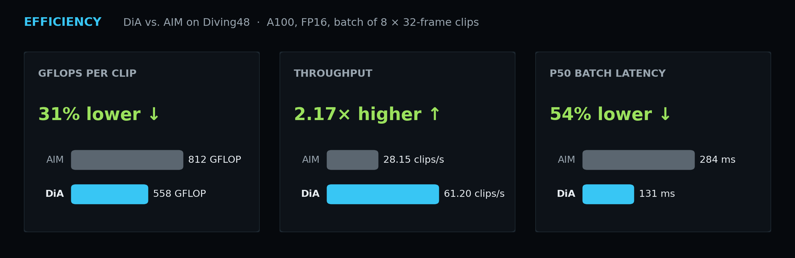
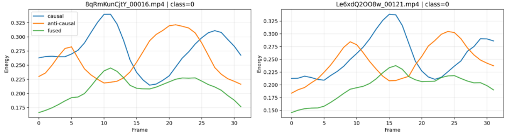

<div align="center">

# 🪔 DiA: Directional Adapter (NeurIPS'26)

### Fine-Grained Action Recognition with a Frozen CLIP Visual Foundation Model

**Ashish Kumar Singh**<sup>1\*</sup> &nbsp;·&nbsp; **Prakash Chandra Chhipa**<sup>2\*</sup>

<sup>1</sup>Machine Learning Group, Luleå University of Technology &nbsp;&nbsp; <sup>2</sup>Scalable Systems, RISE Research Institutes of Sweden

<sup>\*</sup><i>Joint first authors with equal contributions</i>

<!-- TODO: replace xxxx.xxxxx with the arXiv id, and add a project-page badge if you have one -->
[](https://neurips.cc/)
[](https://arxiv.org/abs/xxxx.xxxxx)
[](https://pytorch.org/)
[](https://github.com/openai/CLIP)
[](LICENSE)

<br/>



<br/>

*Understanding not only **what** happened, but **how** the action unfolded over time.*

</div>

---

## 📣 News

<!-- TODO: fill in dates -->
- **[2026-xx]** 🎉 DiA is accepted at **NeurIPS 2026**!
- **[2026-xx]** Code and training configs released.

## ✨ Highlights

<table align="center">
<tr>
<td align="center" width="33%"><h3>92.8%</h3>Top-1 on Diving48<br/><sub>+3.9 over AIM</sub></td>
<td align="center" width="33%"><h3>~3.6M</h3>tunable parameters<br/><sub>vs. 11.0M for AIM</sub></td>
<td align="center" width="33%"><h3>7 benchmarks</h3>state of the art<br/><sub>among single-stream RGB methods</sub></td>
</tr>
<tr>
<td align="center"><h3>31% lower</h3>GFLOPs per clip</td>
<td align="center"><h3>2.17× higher</h3>throughput</td>
<td align="center"><h3>54% lower</h3>median latency</td>
</tr>
</table>

Fine-grained action recognition often depends on **how an action unfolds over time** rather than on appearance alone. In FineGym, *switch leap with 0.5 turn* and *switch leap with 1 turn* look almost the same; in Diving48, *Forward 2.5 som 2 twist pike* and *Forward 2.5 som 3 twist pike* differ only in rotation count. The evidence before an action state and the evidence after it are not interchangeable, so aggregating temporal context uniformly can wash out exactly the cues that separate these classes.

**DiA** is a parameter-efficient adapter for a **frozen CLIP visual backbone** that decomposes temporal evidence into a **causal** (past → present) and an **anti-causal** (future → present) direction, and combines them with a **learnable directional fusion**. Both directions are depth-wise temporal convolutions in a compact bottleneck, so DiA stays small and fast. It is designed for the *accuracy, compute-efficiency and unimodality* objective: better recognition, few tunable parameters, low compute, and **video only**, with no pose estimation or language supervision.

> **Why "DiA"?** Pronounced *diya* (दीया), the Hindi word for a small oil lamp. DiA lights a more efficient path for video understanding.

<details>
<summary><b>📌 One-page overview (click to expand)</b></summary>
<br/>
<div align="center">

</div>
</details>

---

## 🧠 Method

<p align="center">

</p>

DiA sits after the attention and MLP sub-blocks of the frozen CLIP ViT-B/16 transformer blocks. Inside each adapter, the patch tokens go through:

1. **Down** projection (1×1 conv) from C = 768 to a bottleneck of C<sub>a</sub> = αC = 192 channels;
2. a **causal** depth-wise temporal conv with left replicate padding (past → present) and an **anti-causal** depth-wise temporal conv with right replicate padding (future → present), kernel size k = 5;
3. **learnable directional fusion**: λ<sub>→</sub>, λ<sub>←</sub> = softmax(a), output = λ<sub>→</sub>·Y<sub>→</sub> + λ<sub>←</sub>·Y<sub>←</sub>;
4. **GELU** and an **Up** projection (1×1 conv) back to 768 channels, **zero-initialised** so DiA starts as an identity mapping and preserves the CLIP priors.

DiA only updates patch tokens; the following self-attention layers carry the refined information to the `[CLS]` token. Frame-wise `[CLS]` features are averaged over time and fed to a linear classifier.

<p align="center">

</p>

<details>
<summary><b>Core of the adapter in code</b> (from <a href="models/base/adapter.py"><code>models/base/adapter.py</code></a>)</summary>

```python
def _causal_anticausal(self, y):            # y: (B·H·W, C_a, T)
    T, pad = y.shape[-1], self.temporal_causal.kernel_size[0] - 1

    y_c = self.temporal_causal(F.pad(y, (pad, 0), mode="replicate"))[:, :, :T]       # past → present
    y_a = self.temporal_anticausal(F.pad(y, (0, pad), mode="replicate"))[:, :, -T:]  # future → present

    w = F.softmax(self.temporal_direction_weight, dim=0)                           # learnable fusion
    return w[0] * y_c + w[1] * y_a

# forward: tokens -> down (1x1) -> _causal_anticausal -> GELU -> up (1x1, zero-init) -> + tokens
```
</details>

---

## 📊 Results

All results use CLIP ViT-B/16, 32 input frames and RGB video only, averaged over three random seeds.

<p align="center">

</p>

### State of the art on seven benchmarks

| Benchmark | Domain | Tunable params | Best prior result in the paper | **DiA (ours)** |
|:--|:--|:--:|:--:|:--:|
| Diving48 | Sports · diving | 3.6M | 88.9 (AIM) | **92.8** ± 0.15 |
| FineGym99 | Sports · gymnastics | 3.0M | 94.9 (AIM) | **96.2** ± 0.13 |
| FineGym288 | Sports · gymnastics | 3.0M | 90.2 (ART) | **91.7** ± 0.10 |
| HAA500 | Atomic human actions | 2.3M | 80.9 (P2S + EVL) | **82.4** ± 0.08 |
| Toyota Smarthome (CS) | Daily activities | 3.7M | 84.3 (AIM) | **86.8** ± 0.12 |
| MPII Cooking 2 | Cooking | 3.7M | 76.1 (AIM) | **78.7** ± 0.15 |
| HMDB51 | General human actions | 3.6M | 82.4 (AIM) | **85.6** ± 0.10 |

On **Something-Something V2** (16 frames), DiA reaches **69.2%** with only 3.0M tunable parameters, on par with other parameter-efficient methods (ST-Adapter 69.3% with 7.2M, AIM 68.1% with 14M).

### Accuracy vs. tunable parameters

<p align="center">

</p>

<sub>Diving48, values from Table 1 of the paper. EVL (32.9M, 51.4%) is omitted to keep the axis readable.</sub>

### Efficiency

<p align="center">

</p>

| Method | Top-1 ↑ | GFLOPs / clip ↓ | Throughput (clips/s) ↑ | Effective compute (TFLOP/s) ↑ | p50 latency (ms) ↓ |
|:--|:--:|:--:|:--:|:--:|:--:|
| AIM | 88.9 | 812.06 | 28.15 | 22.86 | 284.14 |
| **DiA** | **92.8** | **558.37** | **61.20** | **34.17** | **130.73** |
| *Gain* | *+3.9* | *−31.24%* | *2.17×* | *1.49×* | *−53.98%* |

<sub>Diving48, single NVIDIA A100-SXM4-40GB, FP16 inference, batches of 8 clips of shape [3, 32, 224, 224]. FLOPs from fvcore, latency from CUDA events.</sub>

### Video only vs. multimodal

DiA uses only RGB video, yet matches or beats PeVL, which combines video, pose and text:

| Method | Backbone | Tunable params | Diving48 | FineGym99 | FineGym288 |
|:--|:--:|:--:|:--:|:--:|:--:|
| PeVL (video + pose + text) | ViT-B/16 | 42.0M | 91.9 | **96.5** | 90.5 |
| PeVL (video only) | ViT-B/16 | 28.0M | 84.5 | 91.2 | 85.4 |
| **DiA (video only)** | ViT-B/16 | 3.7M | **92.8** | 96.2 | **91.7** |
| PeVL (video + pose + text) | ViT-L/14 | 109.0M | 92.5 | 97.0 | 91.8 |
| **DiA (video only)** | ViT-L/14 | 12.7M | **93.8** | – | **92.9** |

### Ablations on Diving48

<table>
<tr><th>Directions</th><th>Adapted blocks</th><th>Input frames</th></tr>
<tr><td valign="top">

| Component | Top-1 |
|:--|:--:|
| Causal only | 91.3 |
| Anti-causal only | 91.5 |
| **Causal + anti-causal** | **92.8** |

</td><td valign="top">

| Blocks | AIM | DiA |
|:--:|:--:|:--:|
| 6 | 87.3 (5.3M) | **90.6** (1.8M) |
| 10 | 87.7 (8.9M) | **92.7** (3.0M) |
| 12 | 88.9 (11.0M) | **92.8** (3.7M) |

</td><td valign="top">

| Frames | AIM | DiA |
|:--:|:--:|:--:|
| 8 | 81.8 | **83.0** |
| 16 | 84.7 | **90.5** |
| 32 | 88.9 | **92.7** |

</td></tr>
</table>

The two directions are complementary, and performance saturates around 10 adapted blocks, which the released configs use as the best accuracy and parameter trade-off.

### Do both directions matter?

<p align="center">

</p>

On Diving48 test clips, the causal (blue) and anti-causal (orange) responses peak at **different frames**, so the two directions react to different phases of the action, and the fused response (green) combines them. Their energies are negatively correlated (mean −0.19), both directions stay active on every clip, and the learned fusion weights stay close to 50/50 in every layer (mean 0.503 / 0.497), so neither direction collapses.

### Few-shot

| Method | UCF101 (K=2) | UCF101 (K=4) | HMDB51 (K=2) | HMDB51 (K=4) |
|:--|:--:|:--:|:--:|:--:|
| Storyboard | 92.1 | 93.0 | 64.0 | 66.1 |
| **DiA** | **93.7** | **96.9** | **77.1** | **85.5** |

### Pre-trained checkpoints

<!-- TODO: add download links (e.g. Hugging Face / Google Drive / GitHub release assets) -->
| Benchmark | Download |
|:--|:--:|
| Diving48 | coming soon |
| FineGym99 | coming soon |
| FineGym288 | coming soon |
| HAA500 | coming soon |

---

## ⚙️ Installation

Tested with Python 3.10 and PyTorch 2.x on Linux with CUDA GPUs.

```bash
git clone https://github.com/<org>/DiA.git      # TODO: update URL
cd DiA

conda create -n dia python=3.10 -y
conda activate dia

# 1) PyTorch: choose the build that matches your CUDA (https://pytorch.org/get-started/locally/)
pip install torch torchvision --index-url https://download.pytorch.org/whl/cu121

# 2) Everything else
pip install -r requirements.txt

# 3) OpenAI CLIP (needs setuptools<81, already pinned in requirements.txt)
pip install --no-build-isolation git+https://github.com/openai/CLIP.git
```

Quick sanity check:

```bash
python -c "import torch, clip, decord, einops; print('CUDA:', torch.cuda.is_available())"
```

The CLIP ViT-B/16 weights (~350 MB) are downloaded automatically on the first run to `~/.cache/clip`.

---

## 📁 Data preparation

**1. Download the videos** from the official dataset pages ([Diving48](http://www.svcl.ucsd.edu/projects/resound/dataset.html), [FineGym](https://sdolivia.github.io/FineGym/), [HAA500](https://www.cse.ust.hk/haa/), [Something-Something V2](https://www.qualcomm.com/developer/software/something-something-v-2-dataset), [HMDB51](https://serre-lab.clps.brown.edu/resource/hmdb-a-large-human-motion-database/)). FineGym is distributed as event/element timestamps, so trim the element clips first; the expected file names are listed in the split files.

**2. Put all clips of a dataset in one flat folder.** The split files only store file names, so this folder is all the code needs:

```
/data/Diving48/videos/
├── -mmq0PT-u8k_00155.mp4
├── -mmq0PT-u8k_00156.mp4
└── ...
```

**3. Use the provided splits.** They live in `config/<dataset>/full_supervised/`, one `<file name> <label>` pair per line; any format `decord` can read (`.mp4`, `.avi`, `.webm`, …) works.

<!-- TODO: add splits/configs for Toyota Smarthome (CS) and MPII Cooking 2 (67 classes, 70/30 split) -->
| Dataset | Train split | Test split | # train | # test |
|:--|:--|:--|--:|--:|
| Diving48 (V2) | `Diving48_V2_train.txt` | `Diving48_V2_test.txt` | 15,027 | 1,970 |
| FineGym99 | `gym99_train.txt` | `gym99_test.txt` | 19,859 | 8,420 |
| FineGym288 | `gym288_train.txt` | `gym288_test.txt` | 20,518 | 8,860 |
| HAA500 | `train_new.txt` | `test_new.txt` | 8,000 | 1,500 |
| SSv2 | `ssv2_train.txt` | `ssv2_test.txt` | 168,913 | 27,157 |
| HMDB51 | `hmdb51_train.txt` | `hmdb51_test.txt` | 4,714 | 1,398 |

**4. Point the config at your videos** by editing `DATA.DATA_ROOT_DIR` in the YAML (or override it on the command line, see below).

---

## 🚀 Training

Run every command from the **repository root** (configs resolve `../base.yaml` and `ANNO_DIR` relative to it).

```bash
python runs/train.py --cfg config/diving48/ViT_diving48_full_supervised_finegrained_st_32_50ep_reg.yaml
python runs/train.py --cfg config/finegym99/ViT_finegym99_finegrained_st_32_80ep_reg.yaml
python runs/train.py --cfg config/finegym288/ViT_finegym288_finegrained_st_32_80ep_reg.yaml
python runs/train.py --cfg config/haa500/ViT_haa500_full_supervised_finegrained_st_32.yaml
```

All configs follow the paper's recipe: 32 frames, 224×224 crops, AdamW with learning rate 0.0025, weight decay 0.05, cosine decay with warm-up, 50 epochs.

String-valued keys can be overridden after the config path as `KEY VALUE` pairs:

```bash
python runs/train.py --cfg config/diving48/ViT_diving48_full_supervised_finegrained_st_32_50ep_reg.yaml \
    DATA.DATA_ROOT_DIR /data/Diving48/videos/ \
    OUTPUT_DIR output/diving48_dia
```

> [!IMPORTANT]
> Command-line overrides are passed through as **strings**. Change numeric settings (`NUM_GPUS`, `TRAIN.BATCH_SIZE`, `SOLVER.MAX_EPOCH`, `ADAPTER.APPLY_LAST_N`, …) in the YAML file instead.

**GPU setup.** The released configs use 4 GPUs (`NUM_GPUS: 4`, `CUDA_VISIBLE_DEVICES: 0, 1, 2, 3`). `TRAIN.BATCH_SIZE` is the **global** batch size (8, as in the paper) and is split across GPUs. For a single GPU, set in the YAML:

```yaml
NUM_GPUS: 1
CUDA_VISIBLE_DEVICES: "0"           # keep the quotes, the value must be a string
INIT_METHOD: tcp://localhost:1451   # use a different port for each concurrent run
```

**What gets written.** Logs (`train.log`) and checkpoints go to `OUTPUT_DIR`. Checkpoints are saved every `TRAIN.CHECKPOINT_PERIOD` epochs as `OUTPUT_DIR/checkpoints/checkpoint_epoch_XXXXX.pyth`, and the model is evaluated on the test split every `TRAIN.EVAL_PERIOD` epochs. With `TRAIN.AUTO_RESUME: true` (default), re-running the same command resumes from the latest checkpoint. The number of tunable parameters is printed at start-up.

---

## 🧪 Evaluation

```bash
python runs/test.py --cfg config/diving48/ViT_diving48_full_supervised_finegrained_st_32_50ep_reg.yaml \
    TEST.CHECKPOINT_FILE_PATH output/diving48_dia/checkpoints/checkpoint_epoch_00050.pyth
```

Top-1 / Top-5 accuracy is logged to the console and to `OUTPUT_DIR/test.log`.

---

## 🔧 Configuration

All experiment settings live in YAML files that inherit from [`config/base.yaml`](config/base.yaml). The DiA-specific keys are under `ADAPTER`:

| Key | Released configs | Meaning |
|:--|:--:|:--|
| `TYPE` | `finegrained_causal_anticausal` | DiA. `plain_vanilla` gives a token-wise bottleneck adapter baseline without temporal modelling. |
| `PRETRAINED` | `ViT-B/16` | CLIP visual backbone (kept frozen). |
| `APPLY_LAST_N` | `10` | Number of final transformer blocks that receive an adapter. 10 blocks ≈ 3.0M tunable parameters; set `12` for the 12-block (3.7M) setting. |
| `ADAPTER_SCALE` | `0.25` | Bottleneck ratio α (C<sub>a</sub> = 192). |
| `TEMPORAL_K` | `5` | Kernel size k of the causal and anti-causal temporal convs. |
| `ACT` | `gelu` | Activation after fusion (`gelu` or `relu`). |

Other useful keys: `DATA.NUM_INPUT_FRAMES` (32), `DATA.TRAIN_CROP_SIZE` (224), `VIDEO.HEAD.DROPOUT_RATE`, `AUGMENTATION.LABEL_SMOOTHING`, `SOLVER.BASE_LR`, `SOLVER.MAX_EPOCH`.

### Adding a new dataset

1. Write `train.txt` / `test.txt` files with `<file name> <label>` per line (labels start at 0).
2. Copy one of the existing YAML files and change `TRAIN.DATASET`, `TEST.DATASET`, `TRAIN.NUM_CLASS`, `DATA.DATA_ROOT_DIR`, `DATA.ANNO_DIR`, `DATA.TRAIN_SPLIT`, `DATA.TEST_SPLIT` and `OUTPUT_DIR`.
3. Train with `python runs/train.py --cfg <your yaml>`.

For SSv2, the paper uses 16 input frames and 45 epochs.

> [!NOTE]
> DiA looks at both past and future frames within a clip, so it is designed for **offline** recognition of trimmed clips. Online recognition, where future frames are not yet available, is a natural extension left for future work.

---

## 🗂️ Repository structure

```
DiA/
├── config/
│   ├── base.yaml                  # shared defaults
│   ├── diving48/  finegym99/  finegym288/  haa500/  ssv2/  hmdb51/
│   │   ├── *.yaml                 # experiment configs
│   │   └── full_supervised/       # train / test split files
├── datasets/                      # video decoding, sampling, augmentation
├── models/base/adapter.py         # CLIP ViT backbone + DiA adapter  ← the method
├── runs/
│   ├── train.py                   # training entry point
│   └── test.py                    # evaluation entry point
├── tools/make_readme_figures.py   # regenerates the plots in assets/ from the paper's numbers
├── utils/                         # config, distributed, checkpoint, logging, …
│   └── causal_anticausal_analysis.py   # probe for per-direction branch energies
└── assets/                        # README figures
```

---

## 📝 Citation

If you find DiA useful, please cite:

<!-- TODO: update with the official NeurIPS BibTeX once available -->
```bibtex
@inproceedings{singh2026dia,
  title     = {DiA: Directional Adapter},
  author    = {Singh, Ashish Kumar and Chhipa, Prakash Chandra},
  booktitle = {Advances in Neural Information Processing Systems (NeurIPS)},
  year      = {2026}
}
```

## 🙏 Acknowledgements

This codebase builds on [D²ST-Adapter](https://github.com/qizhongtan/D2ST-Adapter) and the Alibaba video understanding framework it extends, and uses the pre-trained [OpenAI CLIP](https://github.com/openai/CLIP) models. We compare extensively with [AIM](https://github.com/taoyang1122/adapt-image-models). We thank the authors for releasing their code, and the creators of Diving48, FineGym, HAA500, Toyota Smarthome, MPII Cooking 2, Something-Something V2, HMDB51 and UCF101 for their datasets.

## 📄 License

This project is released under the [Apache License 2.0](LICENSE). Parts of the codebase are adapted from third-party projects (see Acknowledgements) and keep their original notices. Datasets are subject to their own licenses.

<div align="center">
<br/>
<sub>🪔 <b>DiA</b> · lighting a more efficient path for video understanding</sub>
</div>
